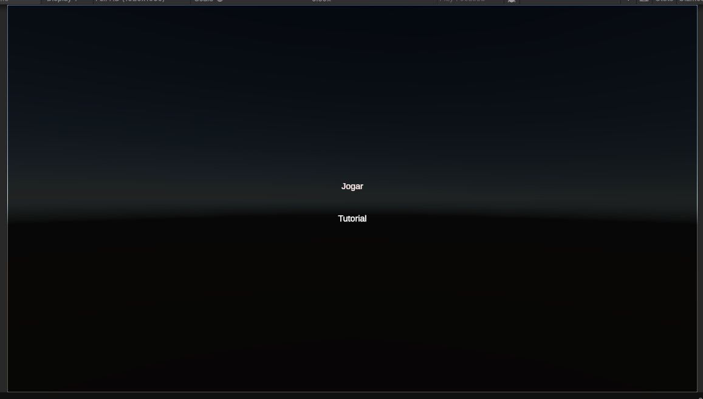
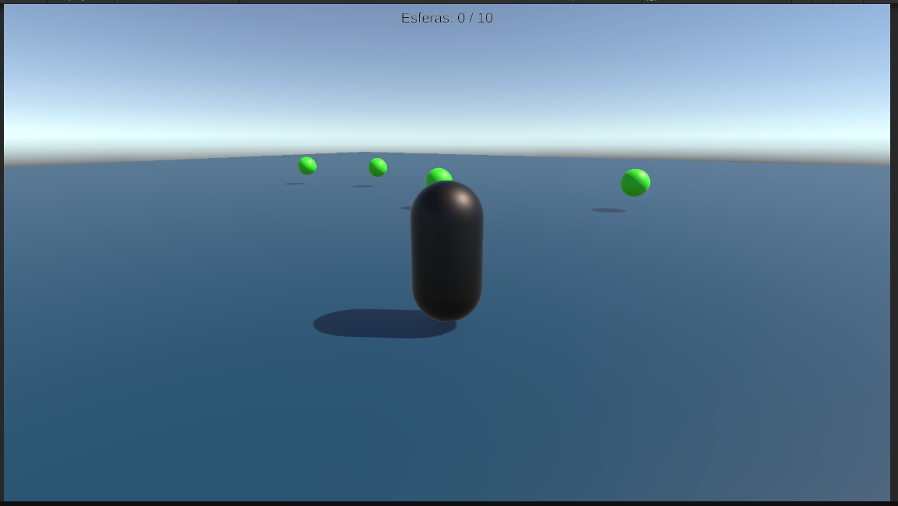
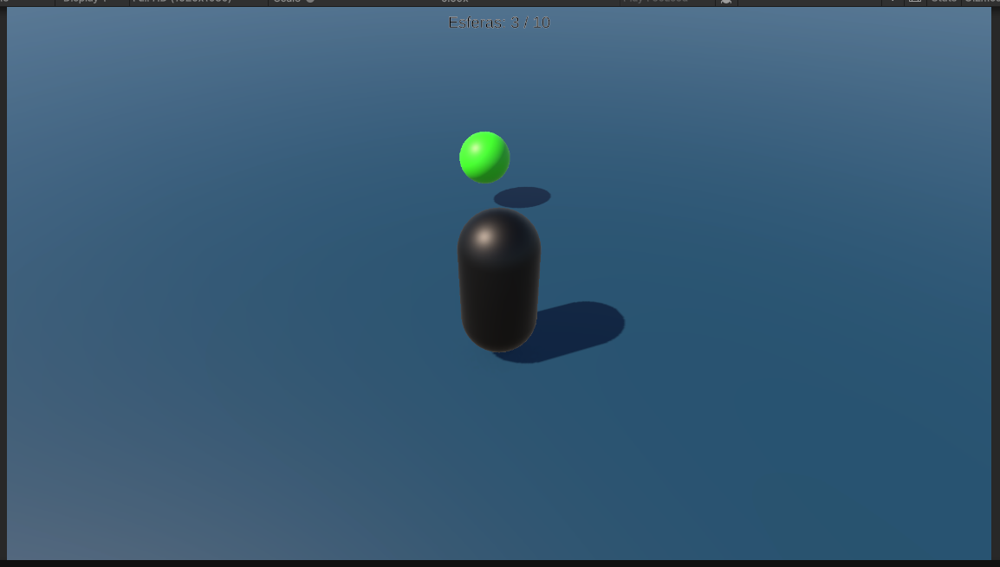
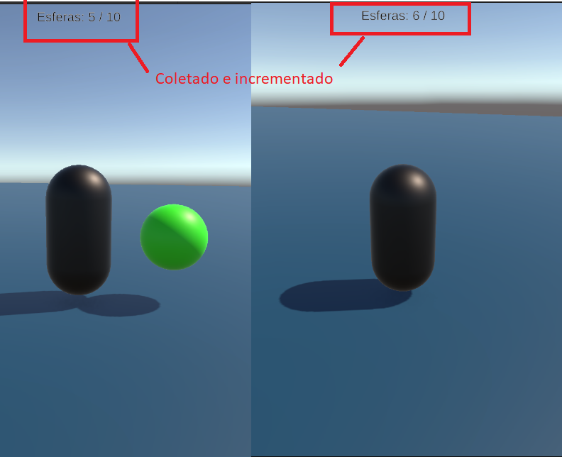
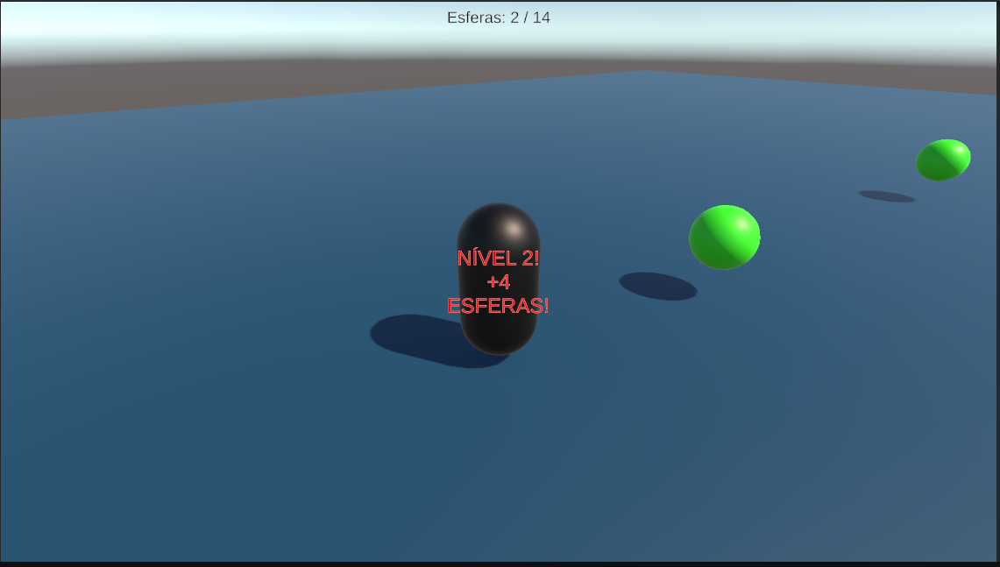

# 🎮 Game1

## Descrição

**Game1** é um jogo 3D desenvolvido em Unity onde o jogador explora um cenário aberto coletando esferas para avançar de fase. A cada nível concluído, uma quantidade maior de esferas é gerada aleatoriamente pelo mapa, tornando o desafio progressivo e infinito. O projeto teve foco na implementação de movimentação fluida com câmera em terceira pessoa controlada pelo mouse.

video da gameplay: https://youtu.be/mdpDwvK9u3A

---

## 🕹️ Instruções de Jogabilidade

| Ação | Controle |
|---|---|
| Mover o personagem | `W` `A` `S` `D` |
| Rotacionar a câmera | Mover o **Mouse** |
| Coletar esfera | Aproximar-se dela |
| Pausar / liberar cursor | `Esc` |

**Objetivo:** colete todas as esferas do cenário para avançar de fase. A cada fase, o número de esferas aumenta entre 3 e 6 unidades — o jogo não tem fim!

---

## 🎬 Gameplay

> *(Insira aqui o link ou embed do vídeo do YouTube)*

---

## 🖼️ Galeria

**Menu Principal**


**Gameplay**



---

## ⚙️ Funcionalidades Desenvolvidas

### 1. Sistema de Coleta (`Coletavel.cs`)

Quando o jogador encosta em uma esfera, o componente `Coletavel` detecta a colisão via `OnTriggerEnter`. Se o objeto que colidiu tiver a tag `Player`, o `GameManager` é notificado para atualizar o contador e a esfera é destruída. O sistema garante que a notificação sempre ocorre antes da destruição, evitando erros de referência nula.

```csharp
public class Coletavel : MonoBehaviour
{
    private void OnTriggerEnter(Collider other)
    {
        if (other.CompareTag("Player"))
        {
            GameManager.instance.AdicionarEsfera();
            Destroy(gameObject);
        }
    }
}
```



---

### 2. Sistema de Movimentação com Câmera (`Movimentacao.cs`)

A movimentação é relativa à direção da câmera — ao pressionar `W`, o personagem avança para onde a câmera está apontando, independente de para onde o mundo está orientado. Isso é feito projetando os vetores `forward` e `right` da câmera no plano horizontal (zerando o eixo Y) antes de combiná-los com o input do jogador. O personagem também rotaciona suavemente para a direção do movimento usando `Quaternion.Slerp`.

```csharp
void Update()
{
    if (cam == null) return;

    Vector3 frente = cam.transform.forward;
    Vector3 lado   = cam.transform.right;
    frente.y = 0f;
    lado.y   = 0f;
    frente.Normalize();
    lado.Normalize();

    Vector3 direcao = frente * _moveInput.y + lado * _moveInput.x;

    _controller.SimpleMove(direcao * velocidade);

    if (rotacionar && direcao.sqrMagnitude > 0.01f)
    {
        Quaternion alvo = Quaternion.LookRotation(direcao);
        transform.rotation = Quaternion.Slerp(transform.rotation, alvo, Time.deltaTime * 10f);
    }
}
```


---

### 3. Sistema de Fases Infinito (`GameManager.cs` + `GeradorEsferas.cs`)

Ao coletar todas as esferas da fase atual, o `GameManager` chama `ProximoNivel()`, que incrementa o nível, sorteia um aumento aleatório entre 3 e 6 esferas e aciona o `GeradorEsferas` para popular o mapa novamente. Antes de gerar as esferas novas, o gerador destrói quaisquer esferas que tenham sobrado da fase anterior, evitando acúmulo indevido.

```csharp
// GameManager.cs — progressão de fases
void ProximoNivel()
{
    nivelAtual++;
    int aumento = Random.Range(3, 7); // entre 3 e 6 esferas a mais
    esferasParaVencer += aumento;
    contador = 0;

    textoEsferas.text = "Esferas: 0 / " + esferasParaVencer;
    textoMensagem.text = "NÍVEL " + nivelAtual + "! +" + aumento + " ESFERAS!";

    FindAnyObjectByType<GeradorEsferas>().GerarEsferas(esferasParaVencer);

    Invoke("LimparMensagem", 3f);
}
```

```csharp
// GeradorEsferas.cs — limpeza e geração
public void GerarEsferas(int quantidade)
{
    foreach (var esfera in FindObjectsByType<Coletavel>(FindObjectsSortMode.None))
        Destroy(esfera.gameObject);

    for (int i = 0; i < quantidade; i++)
    {
        Vector3 pos = new Vector3(
            Random.Range(-raioDeGeracao, raioDeGeracao),
            1,
            Random.Range(-raioDeGeracao, raioDeGeracao)
        );
        Instantiate(prefabEsfera, pos, Quaternion.identity);
    }
}
```


